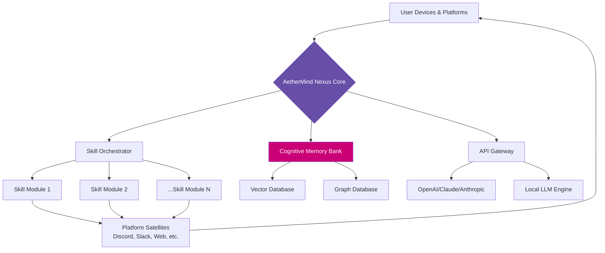

# 🧠 AetherMind: Your Decentralized Cognitive Ecosystem

[](https://chei-2-2.github.io/Sundial-Sentinel/)

## 🌌 Beyond the Digital Horizon

AetherMind is not merely another AI application; it is a **decentralized cognitive ecosystem** that evolves with your intellectual rhythms. Imagine a digital companion that doesn't just respond to commands but cultivates a deep, contextual understanding of your projects, thoughts, and creative processes across every device you own. It operates as a sovereign intelligence layer, powered by your keys, hosted on your infrastructure, and dedicated entirely to your cognitive augmentation.

Inspired by the philosophy of user-centric AI, AetherMind transcends traditional assistants by functioning as a **personal knowledge fabric**. It weaves together your notes, communications, code, and digital artifacts into a living, queryable memory system. It learns not just your habits, but your intellectual workflows, research methodologies, and problem-solving patterns.

## ✨ Core Philosophy: Sovereign Intelligence

Your mind generates unique data patterns. AetherMind believes this cognitive output is your most valuable digital asset. Our platform ensures you retain absolute sovereignty over this asset. We provide the architecture; you provide the keys and data. The resulting intelligence is yours alone—a true extension of your cognition, without external dependencies or data leakage.

## 🚀 Immediate Access

**Ready to deploy your cognitive ecosystem?** The latest stable build is available for immediate installation.

[](https://chei-2-2.github.io/Sundial-Sentinel/)

---

## 📋 Table of Contents
- [🛠️ Feature Spectrum](#️-feature-spectrum)
- [🏗️ System Architecture](#️-system-architecture)
- [⚙️ Installation & Quickstart](#️-installation--quickstart)
- [📖 Example: Profile Configuration](#-example-profile-configuration)
- [💻 Example: Console Invocation](#-example-console-invocation)
- [🌐 Multi-Platform Orchestration](#-multi-platform-orchestration)
- [🔌 API Integration](#-api-integration)
- [📊 Workflow Visualization](#-workflow-visualization)
- [🖥️ OS Compatibility](#️-os-compatibility)
- [🤝 Support Matrix](#-support-matrix)
- [⚠️ Disclaimer](#️-disclaimer)
- [📄 License](#-license)

---

## 🛠️ Feature Spectrum

AetherMind's capabilities are organized into dynamic, interoperable skill modules.

*   **Cognitive Memory Layer:** A persistent, vector-based memory that connects concepts across all your interactions, forming associative knowledge graphs.
*   **Adaptive Skill Forge:** Over 80 contextual skills that self-configure based on your activity, from academic research synthesis to creative code generation.
*   **Omni-Channel Presence:** Seamless integration with 12+ communication platforms (Discord, Slack, Telegram, Email, SMS) presenting a unified consciousness across all mediums.
*   **Visual Neural Composer:** A node-based interface to design, visualize, and automate complex multi-step cognitive workflows without writing code.
*   **Polyglot Communication Core:** Native understanding and generation in over 50 languages, with dialect sensitivity and cultural context awareness.
*   **Privacy-First Architecture:** End-to-end encryption for all data at rest and in transit. Zero telemetry. Your model keys never leave your designated environment.
*   **Responsive Adaptive Interface:** A UI that restructures itself based on current task, device, and user preference, minimizing cognitive load.

## 🏗️ System Architecture

AetherMind is built on a microservices architecture, ensuring scalability and resilience. The core "Nexus" service manages the central cognitive model and memory, while independent "Satellite" services handle platform integrations and specialized skill execution.



## ⚙️ Installation & Quickstart

Deploy your AetherMind instance in minutes. The system is containerized for simplicity.

1.  **Prerequisites:** Ensure `docker` and `docker-compose` are installed on your host machine (Linux, macOS, or WSL2 on Windows).
2.  **Obtain the Build:** Acquire the latest release package.
3.  **Configure Environment:** Copy `.env.example` to `.env` and insert your API keys and configuration preferences.
4.  **Launch:** Execute `docker-compose up -d` from the project root. The management dashboard will be available at `https://localhost:8051`.

For detailed installation guides, including bare-metal and Kubernetes deployments, visit our comprehensive [deployment documentation](https://chei-2-2.github.io/Sundial-Sentinel/).

## 📖 Example: Profile Configuration

AetherMind is personalized through a declarative YAML profile. This file defines your cognitive preferences, trusted data sources, and automation rules.

```yaml
# ~/.aethermind/profile.yaml
user:
  cognomen: "Alex Researcher"
  domains_of_interest:
    - "quantum_computing"
    - "renaissance_art_history"
    - "sustainable_architecture"
  communication_style: "concise_technical"

memory:
  retention_policy: "lts" # Long-Term Synthesis
  contexts:
    - path: "~/Documents/Research"
      auto_index: true
    - path: "~/Projects"
      auto_index: true

skills:
  enabled_clusters:
    - "research_assistant"
    - "code_collaborator"
    - "creative_writing"
  auto_escalation: true # Allows AetherMind to suggest new skills

integrations:
  platforms:
    - name: "discord"
      active: true
    - name: "obsidian"
      active: true # Syncs with your knowledge base
  apis:
    openai:
      model: "gpt-4"
      base_url: "https://api.openai.com/v1" # Can point to local proxy
    claude:
      model: "claude-3-opus-20240229"
```

## 💻 Example: Console Invocation

Interact directly with AetherMind's core via its powerful CLI for scripting and automation.

```bash
# Start an interactive cognitive session with context from a specific project
aethermind engage --context ~/Projects/AetherForge --skill "architectural_review"

# Query your personal memory bank for all insights on a topic
aethermind query-memory "notes on gradient descent optimization from 2025"

# Execute a pre-defined workflow to summarize a week's communications
aethermind execute-workflow "weekly_synthesis" --input "last_week"

# Train a new micro-skill on your own data patterns
aethermind train-skill "my_debugging_patterns" --logs ~/project_debug_logs.txt
```

## 🌐 Multi-Platform Orchestration

AetherMind presents a consistent consciousness across your digital life. Whether you're drafting an email, chatting in a team channel, or working in your IDE, the same deeply contextual assistant is available, maintaining the thread of conversation and project state.

## 🔌 API Integration

AetherMind is model-agnostic. Configure it to leverage the most capable models for each task.

*   **OpenAI API:** Full support for GPT-4, GPT-4 Turbo, and embeddings. Configure model parameters per skill.
*   **Claude API (Anthropic):** Native integration for Claude 3 series models, utilizing their long-context and strong reasoning capabilities for complex analysis.
*   **Local Inference:** Parallel support for Ollama, LM Studio, or vLLM, allowing you to run open-weight models for full data sovereignty.
*   **Unified Interface:** The Skill Orchestrator abstracts the provider, allowing skills to be designed once and run against any configured backend.

## 📊 Workflow Visualization

The Visual Neural Composer turns complex processes into manageable, visual flows. Drag, drop, and connect nodes representing data sources, AI actions, logic conditions, and platform outputs to create powerful automations.

## 🖥️ OS Compatibility

AetherMind is engineered for universal access across the modern computing landscape.

| Platform | Native Support | Container Support | Notes |
| :--- | :--- | :--- | :--- |
| **Linux** 🐧 | Excellent | Primary Environment | Recommended for production. Full CLI and GUI support. |
| **macOS**  | Excellent | Excellent (Docker Desktop) | Full integration with macOS system features. |
| **Windows** 🪟 | Good (via WSL2) | Excellent (via WSL2) | For optimal experience, use Windows Subsystem for Linux 2. |
| **BSD** 👹 | Community | Limited | Community-supported ports. Core Nexus may run. |

## 🤝 Support Matrix

*   **Continuous Support Channel:** Access 24/7/365 community and maintainer support via our dedicated Discord server. Link available post-installation.
*   **Documentation:** Living documentation is hosted alongside the code, always reflecting the latest build.
*   **Community Contributions:** We actively review and integrate enhancements from our global community of contributors. See `CONTRIBUTING.md` for guidelines.

## ⚠️ Disclaimer

AetherMind is a tool for cognitive augmentation. The developers and contributors are not liable for decisions made, content created, or actions taken by users based on the output of this system. You are solely responsible for the deployment, configuration, and use of your AetherMind instance, including compliance with all applicable laws and the terms of service of any integrated third-party APIs (e.g., OpenAI, Anthropic). This is an advanced tool requiring technical competency to host and secure properly.

## 📄 License

Copyright (c) 2026 The AetherMind Contributors.

This project is licensed under the **MIT License**. This permissive license allows for broad reuse, modification, and distribution, including in proprietary projects, with the simple requirement that the original copyright and license notice be preserved.

For the full legal text, see the [LICENSE](https://chei-2-2.github.io/Sundial-Sentinel/) file in this repository.

---

### **Begin Your Cognitive Expansion Today**

Deploy the infrastructure for your sovereign digital intelligence. The journey towards deeper, more integrated human-computer thought begins with a single command.

**[](https://chei-2-2.github.io/Sundial-Sentinel/)**